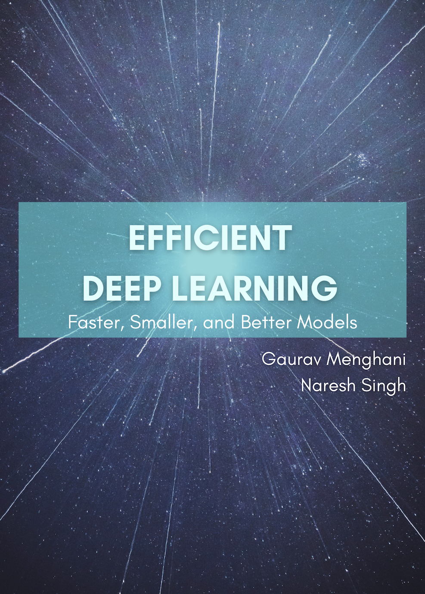

# Efficient Deep Learning Book

## [Report errata and feedback](https://github.com/EfficientDL/book/issues).

We welcome any errata / feedback / ideas. Please file them as an issue [here](https://github.com/EfficientDL/book/issues).

## Official book website: [efficientdlbook.com](https://efficientdlbook.com) ###

The field of Deep Learning has progressed exponentially, and so has the footprint of ML models like BERT, GPT-3, ResNet, etc. While they work great, training and deploying these large (and growing) models in production is expensive. You might want to deploy your face filter model on smartphones to let your users add a puppy filter on their selfies. But it might be too big or too slow, or you might want to improve the quality of your cloud-based spam detection model but you don’t want to pay for a bigger cloud VM to host a more accurate but larger model. What if you don’t have enough labeled data for your models, or can’t manually tune your models? All this is daunting!

What if you could make your models more efficient: use less resources (model size, latency, training time, data, manual involvement) and deliver better quality (accuracy, precision, recall, etc.). That sounds wonderful! But how?

 

This book will go through algorithms and techniques used by researchers and engineers at Google Research, Facebook AI Research (FAIR), and other eminent AI labs to train and deploy their models on devices ranging from large server-side machines to tiny microcontrollers. In this book we present a balance of fundamentals as well as practical know-how to fully equip you to go ahead and optimize your model training and deployment workflows such that your models perform as well or better than earlier, with a fraction of resources. We also will present deep dives into popular models, infrastructure, and hardware, along with challenging projects to test your skills.

## Collaborations
In addition to the principal authors (Gaurav and Naresh), several students and industry experts have reviewed the contents of the book, and contributed to various topics and exercises. We wholeheartedly acknowledge their contributions towards the advancement of this project.

### Reviewers
* Dhruv Matani ([@dhruvbird](https://github.com/dhruvbird))
* Lawrence Moroney ([@lmoroney](https://github.com/lmoroney))
* Sayak Paul ([@sayakpaul](https://github.com/sayakpaul))
* Sinduja S
* Uroš Lipovšek
* Vishwesh Ravi Srimali

### Collaborators
* Xavier ([@XanaGA](https://github.com/XanaGA)) has contributed PyTorch codelabs.
